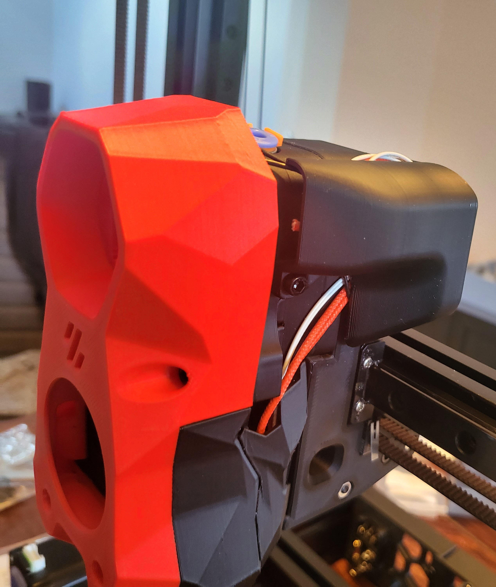

# Dual Bowden Adapter with cover processed for CW2 carriage

Bowden adapter for Stealthburner (SB) or Afterburner (AB)
original Design by Voron Design Team 
You simply use my processed bowden_dual_front_a rest from afterburner repo.
Cover for SB or AB original from Steve https://github.com/stvptrsn
One version in small for AB and SB.
One bigger version with SB design.

https://github.com/VoronDesign/Voron-Afterburner/tree/afterburner/STLs/Bowden

